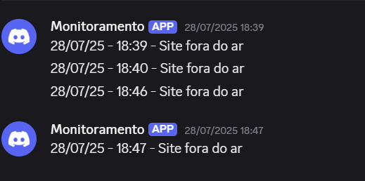
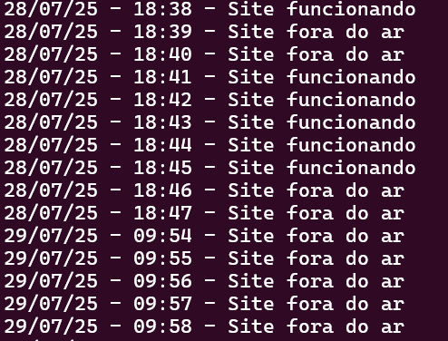

# Infraestrutura Web na AWS com Monitoramento Automatizado
Este projeto consiste na criação de uma infraestrutura básica na AWS utilizando uma instância EC2 com Ubuntu, configuração de servidor web Nginx, e um script de monitoramento que envia alertas via Discord sempre que o site estiver fora do ar.

## Etapas do Projeto

### 1. Criação da Instância EC2 na AWS
### VPC
A VPC funciona como uma rede privada dentro da infraestrutura da AWS. Nela, foi definido um bloco CIDR de 10.0.0.0/16, o que oferece um amplo espaço de endereçamento IP, permitindo a criação de múltiplas sub-redes com diferentes finalidades.

### Sub-redes públicas e privadas
Dentro da VPC, foram criadas quatro sub-redes:
- Duas Sub-redes públicas: utilizadas para hospedar recursos que precisam estar acessíveis pela internet, como a instância EC2 com o servidor web.
- Duas Sub-Redes privadas: criadas para simular um ambiente mais seguro e realista, normalmente utilizadas para recursos internos, como bancos de dados ou serviços que não devem ser expostos diretamente à internet.
  
### Criação da instância EC2
Dentro de uma das sub-redes públicas, foi criada uma instância do tipo t2.micro utilizando a imagem do Ubuntu Server 24.04. Essa instância serviu como nosso servidor web.

### Autenticação com par de chaves
Para garantir um acesso seguro à instância, foi gerado um par de chaves SSH no momento da criação da EC2. A chave privada (.pem) foi baixada e armazenada localmente. Ela é essencial para autenticar o acesso via terminal, funcionando como uma identidade digital.

### Internet Gateway e Tabela de Rotas
Para permitir que a sub-rede pública tivesse acesso à internet, foi criado e associado um Internet Gateway à VPC. Também foi configurada uma tabela de rotas direcionando o tráfego da sub-rede pública para o gateway, possibilitando a comunicação externa da instância EC2.

### Elastic IP
Por padrão, o IP público de uma instância EC2 muda a cada reinicialização. Isso pode prejudicar o monitoramento do site e o acesso externo. Por esse motivo, foi associado um Elastic IP à instância, garantindo que o endereço IP permaneça fixo independentemente de reinicializações, mantendo o funcionamento consistente do sistema de monitoramento.

Depois que todas as configurações aviam sido finalizadas foi possível acessar a EC2 na WSL por meio do comando.
```bash
ssh -i chaveseguranca.pem ubuntu@elasticip
```

### 2. Configuração do Nginx
Após conectar na instância via SSH, o próximo passo foi a instalação do servidor Nginx com os seguintes comandos:
```bash
sudo apt update
sudo apt install nginx -y
```

Após isso a criação de uma página HTML simples apenas para verificar se o site está funcionando.

```bash
echo "<h1>Servidor funcionando!</h1>" | sudo tee /var/www/html/index.html
```

Com isso, o site passou a estar disponível via navegador usando o Elastic IP.

### 3. Script de Monitoramento com Webhook do Discord
Depois de garantir que o site está funcionando corretamente a próxima etapa era começar o desenvolvimento do script de monitoramento.
Criei um script bash na pasta home do usuário que verifica, a cada minuto, se o site está no ar. Caso não esteja, envia uma notificação para um canal do Discord via Webhook e registra logs localmente.

#### Script Criado:
```bash
#!/bin/bash

WEBHOOK="https://discordapp.com/api/webhooks/UrlDaWebhook"
ARQUIVO_LOG="/var/log/meuScript.log"
URL="http://ElasticIP/"

DATA=$(date '+%d/%m/%y - %H:%M')

# Variável recebe apenas o código do status da requisição
STATUS=$(curl -s -o /dev/null -w "%{http_code}" $URL)

# Verifica se o status é diferente de 200, se sim quer dizer que o site está fora do ar
if [ "$STATUS" != "200" ]
then
        MENSAGEM="$DATA - Site fora do ar"
        echo "$MENSAGEM" >> "$ARQUIVO_LOG"

        # Envia uma mensagem para o discord via webhook informando que site está fora do ar
        curl -H "Content-Type: application/json" \
                -X POST \
                -d "{\"content\": \"$MENSAGEM\"}" \
                "$URL_WEBHOOK"

else
        MENSAGEM="$DATA - Site funcionando"
        echo "$MENSAGEM" >> "$ARQUIVO_LOG"
fi
```

### 4. Agendamento 
Depois da criação do script era necessário configurar o agendamento pra verificação do servidor a cada minuto.
Para isso foi utilizado o comando `crontab` por meio do comando:
```bash
crontab -e
```
E adicionado a linha de comando:
```bash
*/1 * * * * /home/ubuntu/monitor.sh
```

### 5. Conclusão
Após todos os processos realizados o script de monitoramento doi testado e apresentou o comportamento esperado:
- Quando o site está fora do ar, o script envia uma mensagem de alerta para o canal do Discord configurado via webhook.

- As mensagens tanto de funcionamento quanto de erro são armazenadas localmente no arquivo de log (meuScript.log).



